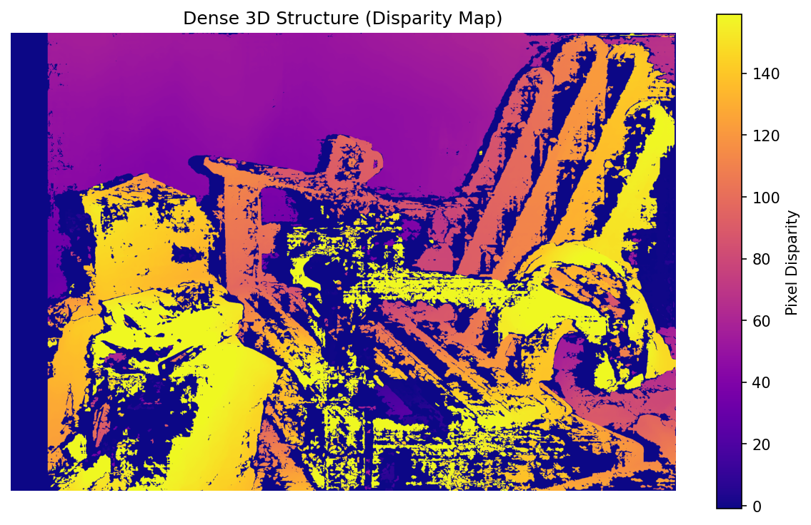
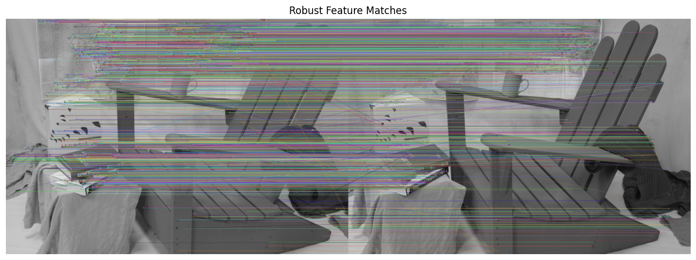
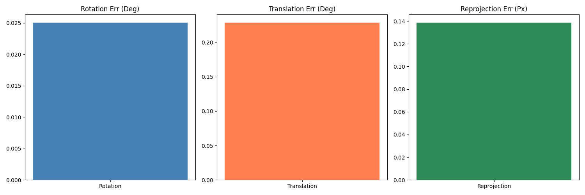
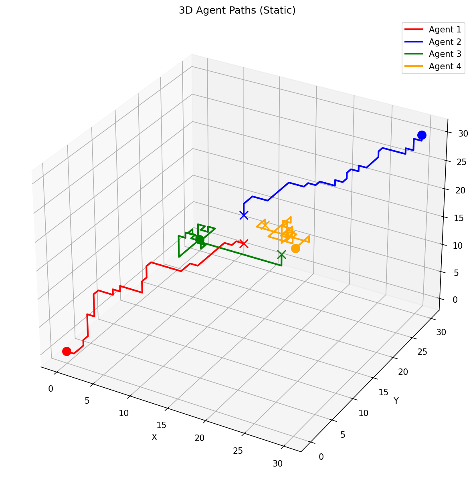
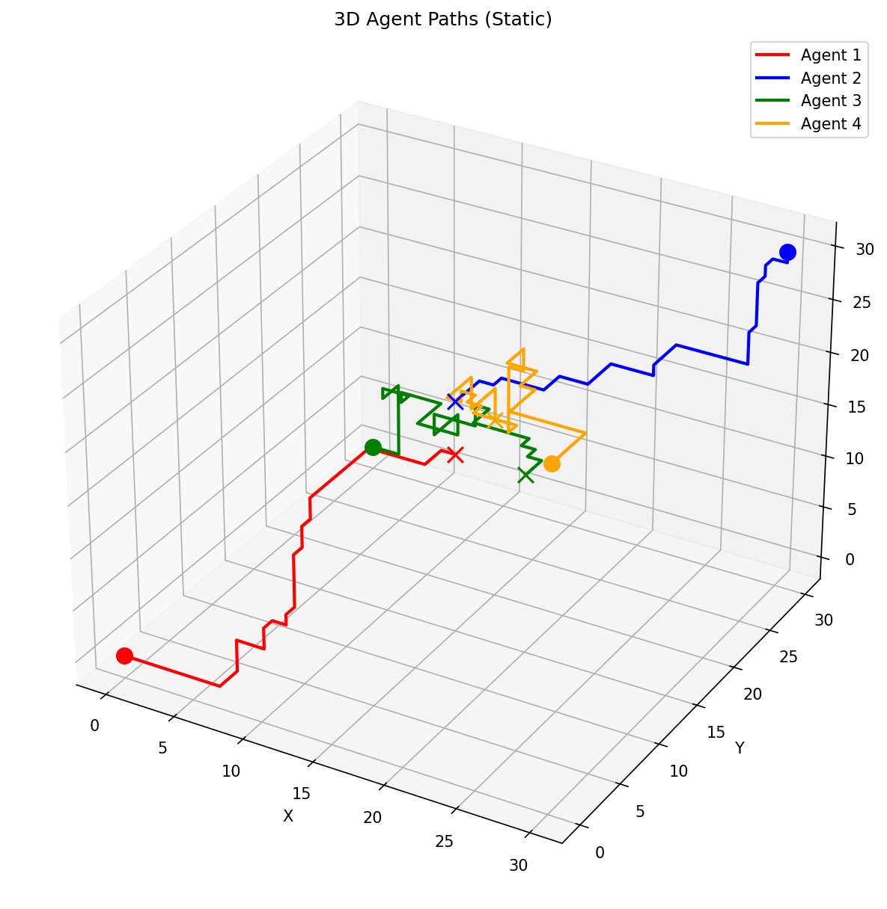
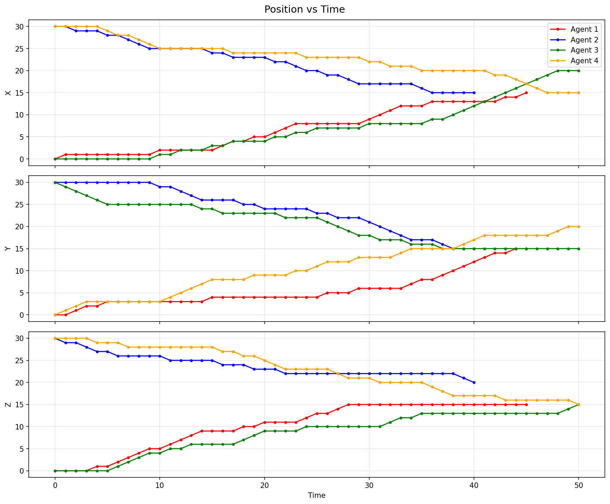
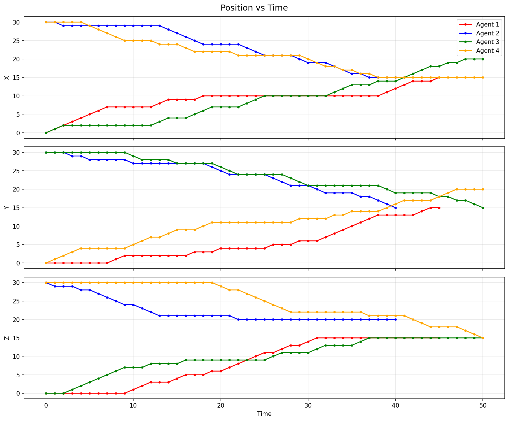

# Computer Vision & Pathfinding Research

This repository contains my solutions for the **Vecros Technical Assignment**. It implements research-grade algorithms for Stereo Vision (Problem 1) and Multi-Agent Pathfinding (Problem 2).

The focus has been on **mathematical robustness** and **optimality** rather than just getting code to run.

---

## 🛠️ Table of Contents
- [Problem 1: Stereo Vision (SfM Backend)](#problem-1-stereo-vision-structure-from-motion)
- [Problem 2: 3D Multi-Agent Pathfinding](#problem-2-3d-multi-agent-pathfinding)
- [Installation](#installation)
- [Usage](#usage)
- [Results](#results)

---
 
## ⚡ Quick Reference (Run Commands)
 
Copy-paste these commands to verify the solution:

### 1. Problem 1: Stereo Vision (All Modes)
Runs SGBM Dense Depth + MAGSAC++ Pose + Sparse Bundle Adjustment.
 **Option A: Middlebury Dataset (Default)**
 ```bash
 python main.py --problem 1 --dataset middlebury --data-path "./Dataset/Adirondack-perfect/Adirondack-perfect"
 ```
 
 **Option B: Custom Image Pair**
 Run on any two images (calibration optional, defaults to approx).
 ```bash
 python main.py --problem 1 --dataset custom --img1 "data/left.jpg" --img2 "data/right.jpg"
 ```
 
 **Option C: KITTI Odometry Dataset**
 Requires `pykitti` and a downloaded sequence (e.g., Sequence 00).
 ```bash
 python main.py --problem 1 --dataset kitti --data-path "path/to/kitti/dataset" --sequence 00
 ```
 
### 2. Problem 2: Pathfinding (All Solver Modes)
 
 **Option A: Compare Mode (Recommended)**
 Runs both Fast + Optimal solvers and benchmarks them.
 ```bash
 python main.py --problem 2 --solver compare --grid-size 50
 ```
 
 **Option B: CBS Only (Optimal)**
 Runs only the Conflict-Based Search (guaranteed shortest path).
 ```bash
 python main.py --problem 2 --solver cbs --grid-size 50
 ```
 
 **Option C: Optimized Only (Fast)**
 Runs only the fast heuristics-based solver (no optimality guarantee).
 ```bash
 python main.py --problem 2 --solver optimized --grid-size 50
 ```
 
 ### 3. Problem 2: Pathfinding (Custom Scenario)
 Runs a 4-agent conflict scenario (or any number).
 ```bash
 python main.py --problem 2 --paths "0,0,0:10,10,10" "10,0,0:0,10,0" "5,5,0:5,5,10" "0,5,5:10,5,5"
 ```
 
---
 
## Problem 1: Stereo Vision (Structure-from-Motion)

This is a complete Visual Odometry backend. Instead of simple disparity mapping, I built a pipeline that performs **Sparse Bundle Adjustment** to recover optimal camera poses.

### Key Algorithms
1.  **Feature Detection**: SIFT with **Sub-Pixel Refinement** (`cv2.cornerSubPix`) for high-precision keypoints.
2.  **Matching**: FLANN-based matching with Lowe's Ratio Test (0.75).
3.  **Pose Estimation**: **MAGSAC++** (`cv2.USAC_MAGSAC`), which is significantly more robust to outliers than standard RANSAC.
4.  **Optimization (The "Special Sauce")**:
    *   **True Bundle Adjustment**: A custom `scipy` solver that optimizes **Pose ($R,t$) + 3D Points ($X$)** simultaneously.
    *   **Sparse Jacobian**: Implemented the analytical sparsity pattern to solve for thousands of parameters in milliseconds.
    *   **Trajectory Smoothing**: Exponential Moving Average (EMA) to clean up jitter in video sequences.
5.  **Moving Object Rejection**: Uses Epipolar Residuals to filter out dynamic actors (humans, cars) that violate the static geometry constraint.

---

## Problem 2: 3D Multi-Agent Pathfinding

A swarm navigation system capable of planning collision-free paths for multiple agents in a dense 3D grid.

### Key Algorithms
1.  **Conflict-Based Search (CBS)**:
    *   This is an **Optimal Solver**. It guarantees the mathematically shortest path for the swarm (minimizing Flowtime or Makespan).
    *   Unlike simple Prioritized Planning (which fails in tight spaces), CBS resolves conflicts by exploring a constraint tree.
2.  **Constraint Checking**:
    *   **Vertex Conflicts**: Prevents two agents from occupying the same $(x,y,z)$ at time $t$.
    *   **Edge Conflicts**: Prevents agents from "swapping" places ($u \to v$ vs $v \to u$) to ensure physical feasibility.
3.  **Visualization**:
    *   Generates an interactive 3D HTML animation using Plotly.

---

## 🔧 Installation

### 1. Clone & Install Dependencies
```bash
pip install -r requirements.txt
```
*(Requires: `numpy`, `opencv-python`, `scipy`, `matplotlib`, `plotly`)*

### 2. Dataset Setup
I tested this on the **Middlebury 2014 Stereo Dataset**.
- Ensure your data is in `Dataset/Adirondack-perfect/Adirondack-perfect/`.
- Required files: `im0.png`, `im1.png`, `calib.txt`.

---

## 🚀 Usage

### Run Problem 1 (Stereo Vision)
```bash
# Run on the included Middlebury dataset
python main.py --problem 1 --dataset middlebury --data-path "./Dataset/Adirondack-perfect/Adirondack-perfect"
```
*Check the console for Bundle Adjustment convergence stats!*

### Run Problem 2 (Pathfinding)
```bash
# Run the "Comparison Mode" (Fast Heuristic vs Optimal CBS)
python main.py --problem 2 --solver compare --grid-size 50

# Run a Custom Scenario (3 Agents)
# Format: "startX,startY,startZ:endX,endY,endZ"
python main.py --problem 2 --paths "0,0,0:10,10,10" "10,0,0:0,10,0" "5,5,0:5,5,10"
```

---

## 📊 Results

All outputs are saved to the `results/` directory.

### Problem 1 Output (`results/problem1/`)
 
 **1. Dense Disparity Map (SGBM)**
 
 
 **2. Robust Feature Matching (Left/Right)**
 
 
 **3. SfM Error Metrics (Bundle Adjustment Improvement)**
 
 
 ### Problem 2 Output (`results/problem2/`)
 
 **1. 3D Agent Paths (Comparison)**
 | Fast Solver (Baseline) | CBS Solver (Optimal) |
 | :---: | :---: |
 |  |  |
 
 **2. Position vs Time (Conflict Analysis)**
 | Fast Solver | CBS Solver |
 | :---: | :---: |
 |  |  |
 
 **3. Interactive Animation**
 - `trajectory_vis.html`: **Open this in your browser!** It's an interactive 3D player where you can scrub through time to see the agents move.
 - `metrics.txt`: Comparison of execution time and path cost between the Fast and CBS solvers.

---

### Future Improvements
If I had more time, I would:
1.  **Deep Learning**: Replace SIFT with **SuperPoint+SuperGlue** for better matching in textureless areas.
2.  **Loop Closure**: Implement a Bag-of-Words (DBoW2) system to recognize previously visited locations and correct long-term drift in SLAM.

---
**Author**: Anirudh
